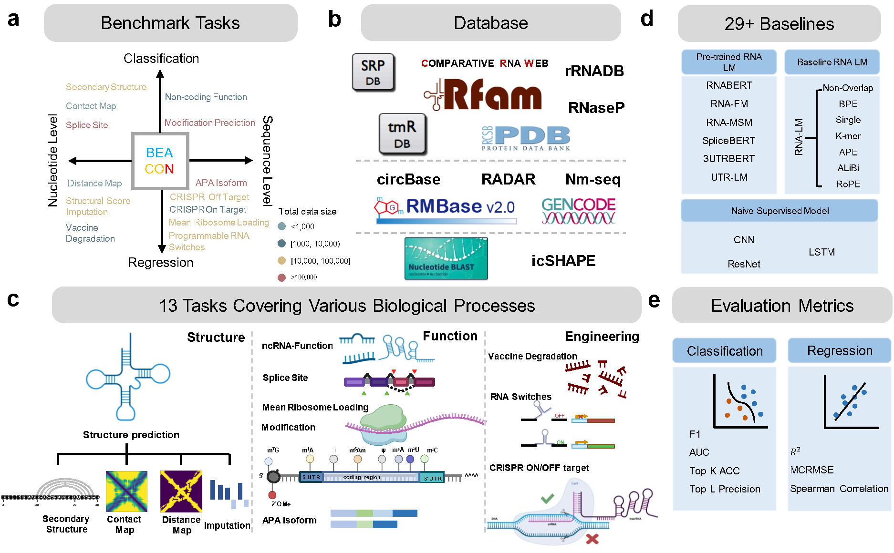
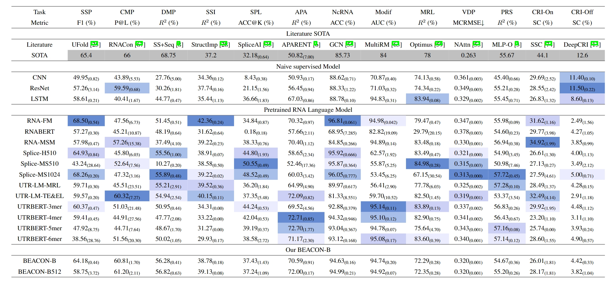
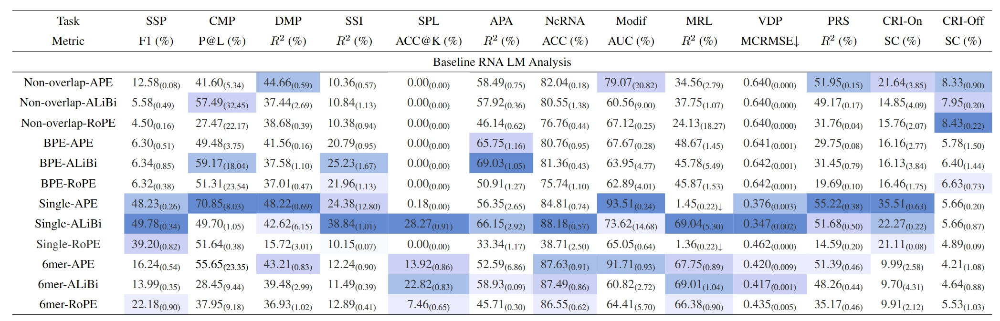

# BEACON: Benchmark for Comprehensive RNA Tasks and Language Models

This is the official codebase of the paper [BEACON: Benchmark for Comprehensive RNA Tasks and Language Models](https://arxiv.org/abs/2406.10391)

<p align="center">
    
</p>

## 🔥 Update
- [07/25]🔥 Updating models list and usage!
- [06/11]🔥 BEACON is coming! We release the [paper](https://arxiv.org/abs/2406.10391), [code](https://github.com/terry-r123/RNABenchmark), [data](https://drive.google.com/drive/folders/19ddrwI8ycvIxkgSV3gDo_VunLofYd4-6?usp=sharing), and [models](https://drive.google.com/drive/folders/1455JIOGV5X96CCgxCT-QgVu0xbXFz72X?usp=sharing) for BEACON!

## Prerequisites

### Installation
important libs:  torch==1.13.1+cu117, transformers==4.38.1


```bash
git clone https://github.com/terry-r123/RNABenchmark.git
cd RNABenchmark
conda activate -n beacon python=3.8
pip install -r requirements.txt
```

## 🔍 Tasks and Datasets

Datasets of RNA tasks can be found in [Google Drive](https://drive.google.com/drive/folders/19ddrwI8ycvIxkgSV3gDo_VunLofYd4-6?usp=sharing)

Model checkpoints of opensource RNA language models and BEACON-B can be found in [Google Drive](https://drive.google.com/drive/folders/1455JIOGV5X96CCgxCT-QgVu0xbXFz72X?usp=sharing)

### Data structure
```
RNABenchmark
├── checkpoint
│   └── opensource
|       ├── rna-fm
|       ├── rnabert
|       ├── rnamsm
|       ├── splicebert-human510
|       ├── splicebert-ms510
|       ├── splicebert-ms1024
|       ├── utr-lm-mrl    
|       ├── utr-lm-te-el    
|       ├── utrbert-3mer    
|       ├── utrbert-4mer  
|       ├── utrbert-5mer  
|       └── utrbert-6mer   
│   └── baseline
|       ├── BEACON-B
|       └── BEACON-B512
├── data
│    ├── ContactMap
│    ├── CRISPROffTarget
│    ├── CRISPROnTarget
│    ├── Degradation
│    ├── DistanceMap
│    ├── Isoform
│    ├── MeanRibosomeLoading
│    ├── Modification
│    ├── NoncodingRNAFamily
│    ├── ProgrammableRNASwitches
│    ├── Secondary_structure_prediction
│    ├── SpliceAI
│    └── StructuralScoreImputation
├── downstream
│   └── structure
├── model
|   |── rna-fm
|   ├── rnabert
|   ├── rnamsm
|   ├── splicebert
|   ├── utrlm      
|   ├── utrbert   
|   └── rnalm  
├── tokenizer
└── scripts
│    ├── BEACON-B
│    └── opensource
```


The full list of current task names are : 

- `Secondary_structure_prediction`
- `ContactMap`
- `DistanceMap`
- `StructuralScoreImputation`
- `SpliceAI`
- `Isoform`
- `NoncodingRNAFamily`
- `Modification`
- `MeanRibosomeLoading`
- `Degradation`
- `ProgrammableRNASwitches`
- `CRISPROnTarget`
- `CRISPROffTarget`


## 🔍Models 
<p align="center">
    
</p>

<p align="center">
    
</p>

And the list of available embedders/models used for training on the tasks are : 

- `rna-fm`
- `rnabert`
- `rnamsm`
- `utr-lm-mrl`
- `utr-lm-te-el` 
- `splicebert-human510`
- `splicebert-ms510`
- `splicebert-ms1024`
- `utrbert-3mer`
- `utrbert-4mer`
- `utrbert-5mer`
- `utrbert-6mer`
### Model settings

| Models | name | token | pos | length| 
| --- | --- | --- | ---| --- |
|[RNA-FM](https://doi.org/10.48550/arXiv.2204.00300) | rna-fm | single  | ape| 1024| 
|[RNABERT](academic.oup.com/nargab/article/4/1/lqac012/6534363) | rnabert | single | ape| 440 | 
|[RNA-MSM](academic.oup.com/nar/article/52/1/e3/7369930)| rnamsm | single | ape | 1024
|[SpliceBERT-H510](academic.oup.com/bib/article/25/3/bbae163/7644137)| splicebert-human510 | single | ape | 510 |
|[SpliceBERT-MS510](academic.oup.com/bib/article/25/3/bbae163/7644137)| splicebert-ms510 | single | ape | 510 |
|[SpliceBERT-MS510](academic.oup.com/bib/article/25/3/bbae163/7644137)| splicebert-ms510 | single | ape | 1024 |
|[UTR-LM-MRL](https://www.nature.com/articles/s42256-024-00823-9) | utr-lm-mrl | single | rope | 1026 |
|[UTR-LM-TE&EL](https://www.nature.com/articles/s42256-024-00823-9)| utr-lm-te-el | single | rope | 1026 |
|[UTRBERT-3mer](https://doi.org/10.1101/2023.09.08.556883) | utrbert-3mer | 3mer |ape| 512 |
|[UTRBERT-4mer](https://doi.org/10.1101/2023.09.08.556883) | utrbert-4mer | 4mer |ape| 512 |
|[UTRBERT-5mer](https://doi.org/10.1101/2023.09.08.556883) | utrbert-5mer | 5mer |ape| 512 |
|[UTRBERT-6mer](https://doi.org/10.1101/2023.09.08.556883) | utrbert-6mer | 6mer |ape| 512 |
|[BEACON-B](https://arxiv.org/abs/2406.10391)| rnalm | single | alibi | 1026 |
|[BEACON-B512](https://arxiv.org/abs/2406.10391)| rnalm | single | alibi | 512 |


## 🔍 Usage
### Finetuning
To evalute on all RNA tasks, you can run the bash scripts in the `scripts` folder, for example:
```
cd RNABenchmark
bash ./scripts/BEACON-B/all_task.sh
```
### Computing embeddings
Embeddings from a dummy RNA sequence can be used as follows:

```python
import os, sys
current_path = os.path.dirname(os.path.abspath(__file__))
parent_dir = os.path.dirname(current_path)
sys.path.append(parent_dir)
from model.utrlm.modeling_utrlm import UtrLmModel
from tokenizer.tokenization_opensource import OpenRnaLMTokenizer

tokenizer = OpenRnaLMTokenizer.from_pretrained('./checkpoint/opensource/utr-lm-mrl', model_max_length=1026, padding_side="right", use_fast=True,)
model = UtrLmModel.from_pretrained('./checkpoint/opensource/utr-lm-mrl')     
sequences = ["AUUCCGAUUCCGAUUCCG"]
output = tokenizer.batch_encode_plus(sequences, return_tensors="pt", padding="longest", max_length = 1026, truncation=True)
input_ids = output["input_ids"]
attention_mask = output["attention_mask"]

embedding = model(input_ids=input_ids,attention_mask=attention_mask)[0] # shape [bz,length, hidden_size]
print(embedding.shape)
```


## License ##

This codebase is released under the Apache License 2.0 as in the [LICENSE](LICENSE) file.

## Citation
If you find this repo useful for your research, please consider citing the paper
```
@misc{ren2024beacon,
      title={BEACON: Benchmark for Comprehensive RNA Tasks and Language Models}, 
      author={Yuchen Ren and Zhiyuan Chen and Lifeng Qiao and Hongtai Jing and Yuchen Cai and Sheng Xu and Peng Ye and Xinzhu Ma and Siqi Sun and Hongliang Yan and Dong Yuan and Wanli Ouyang and Xihui Liu},
      year={2024},
      eprint={2406.10391},
      archivePrefix={arXiv},
      primaryClass={id='q-bio.QM' full_name='Quantitative Methods' is_active=True alt_name=None in_archive='q-bio' is_general=False description='All experimental, numerical, statistical and mathematical contributions of value to biology'}
}
```

